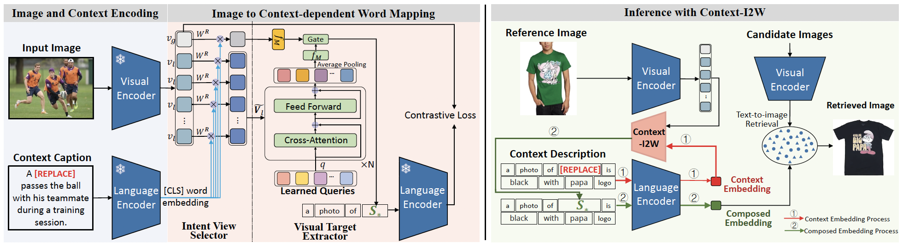

<div align="center">
	
# Context-I2W: Mapping Images to Context-dependent words for Accurate Zero-Shot Composed Image Retrieval (AAAI 2024)
[](https://arxiv.org/abs/2309.16137)
[]()
[](https://github.com/Pter61/context-i2w)

	
[](https://paperswithcode.com/sota/zero-shot-composed-image-retrieval-zs-cir-on-4?p=context-i2w-mapping-images-to-context) <br/>
[](https://paperswithcode.com/sota/zero-shot-composed-image-retrieval-zs-cir-on-6?p=context-i2w-mapping-images-to-context) <br/>
[](https://paperswithcode.com/sota/zero-shot-composed-image-retrieval-zs-cir-on-2?p=context-i2w-mapping-images-to-context) <br/>
[](https://paperswithcode.com/sota/zero-shot-composed-image-retrieval-zs-cir-on-1?p=context-i2w-mapping-images-to-context)
</div>



<div align="justify">

> Different from Composed Image Retrieval task that requires expensive labels for training task-specific models, Zero-Shot Composed Image Retrieval (ZS-CIR) involves diverse tasks with a broad range of visual content manipulation intent that could be related to domain, scene, object, and attribute. The key challenge for ZS-CIR tasks is to learn a more accurate image representation that has adaptive attention to the reference image for various manipulation descriptions. In this paper, we propose a novel context-dependent mapping network, named Context-I2W,  for adaptively converting description-relevant Image information into a pseudo-word token composed of the description for accurate ZS-CIR. Specifically, an Intent View Selector first dynamically learns a rotation rule to map the identical image to a task-specific manipulation view. Then a Visual Target Extractor further captures local information covering the main targets in ZS-CIR tasks under the guidance of multiple learnable queries. The two complementary modules work together to map an image to a context-dependent pseudo-word token without extra supervision. Our model shows strong generalization ability on four ZS-CIR tasks, including domain conversion, object composition, object manipulation, and attribute manipulation. It obtains consistent and significant performance boosts ranging from 1.88% to 3.60% over the best methods and achieves new state-of-the-art results on ZS-CIR.

</div>

## Description
This repository contains the code for the paper ["Context-I2W: Mapping Images to Context-dependent words for Accurate Zero-Shot Composed Image Retrieval"](https://arxiv.org/abs/2309.16137).

### Contribution
1. We **consider manipulation descriptions and learnable queries multi-level constraints for visual information filtering**, which sheds new light on the vision-to-language alignment mechanism.
2.  Our Intent View Selector and Visual Target Extractor selectively **map images dependent on the context of manipulation descriptions**, enhancing the ability of the CLIP Language Encoder to generalize images to complex manipulation descriptions effectively.
3.  Our Context-I2W is **the first to mask the object name while retaining the original caption in CIR tasks**. It builds on the insight that context clues should be paid more attention to in the objective, which is an interesting insight that will motivate future works.
   
## TODO 
1. Inference code and checkpoints
2. Training code

## Data

### Training Data
We utilize [Conceptual Captions URLs](https://ai.google.com/research/ConceptualCaptions/download) to train a model. 
See [open_clip](https://github.com/mlfoundations/open_clip) to see the process of getting the dataset. 

The training data directory has to be in the root of this repo, and should be structured like below.
```bash
  cc_data
    ├── train ## training image diretories.
    └── val ## validation image directories.
  cc
    ├── Train_GCC-training_output.csv ## training data list
    └── Validation_GCC-1.1.0-Validation_output.csv ## validation data list
```

### Test Data
See [README](data/README.md) to prepare test dataset.

### Pre-trained model
The model is available in [GoogleDrive](https://drive.google.com/file/d/1yHv9SgY1-2KrAvd2MmFqH40x4P3gLotQ/view?usp=drive_link).

## Training

### Install dependencies
See [open_clip] for the details of installation. 
The same environment should be usable in this repo.
setenv.sh is the script we used to set-up the environment in virtualenv. 

Also run below to add directory to pythonpath:
```bash
. env3/bin/activate
export PYTHONPATH="$PYTHONPATH:$PWD/src"
export PYTHONWARNINGS='ignore:semaphore_tracker:UserWarning'
```

### Sample evaluation only:

Evaluation on COCO, ImageNet, or CIRR.
```bash
python src/eval_retrieval.py \
    --openai-pretrained \
    --resume /path/to/checkpoints \
    --eval-mode $data_name \ ## replace with coco, imgnet, or cirr
    --gpu $gpu_id
```

Evaluation on fashion-iq (shirt or dress or toptee)
```bash
python src/eval_retrieval.py \
    --openai-pretrained \
    --resume /path/to/checkpoints \
    --eval-mode fashion \
    --source $cloth_type \ ## replace with shirt or dress or toptee
    --gpu $gpu_id
```

## Citing

If you found this repository useful, please consider citing:

```bibtex
@misc{tang2023contexti2w,
      title={Context-I2W: Mapping Images to Context-dependent Words for Accurate Zero-Shot Composed Image Retrieval}, 
      author={Yuanmin Tang and Jing Yu and Keke Gai and Jiamin Zhuang and Gang Xiong and Yue Hu and Qi Wu},
      year={2023},
      eprint={2309.16137},
      archivePrefix={arXiv},
      primaryClass={cs.CV}
}
```

## Credits
- Thanks to [Pic2Word](https://github.com/google-research/composed_image_retrieval) authors, zero-shot accuracy code is adapted from there and pre-trained models are used in the command line interface.
